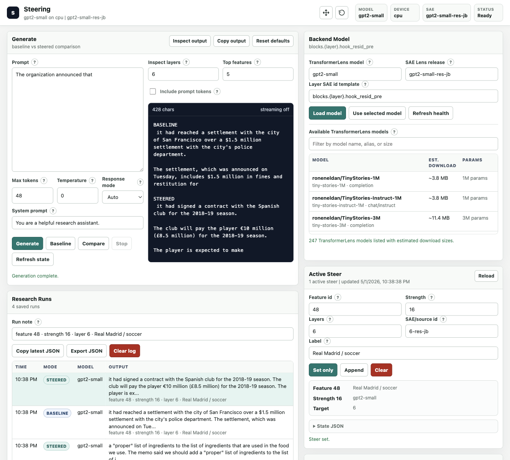
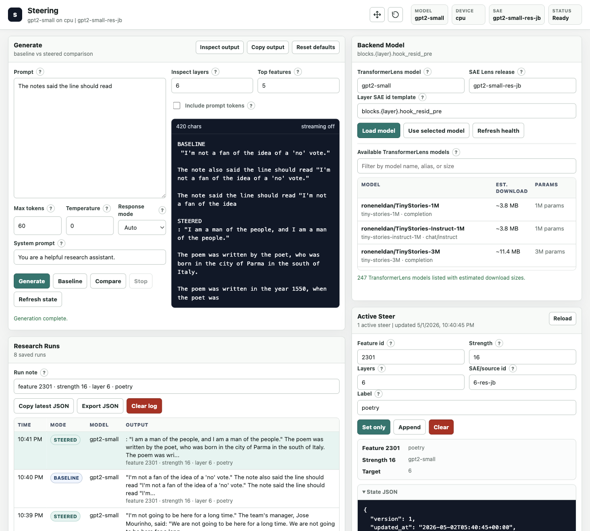

# Steering

A local workbench for live SAE feature steering in TransformerLens models.

Steering runs a FastAPI browser UI, CLI, and Textual TUI around a simple
intervention: during generation, add a selected sparse-autoencoder decoder
direction to the residual stream.

```text
residual += strength * SAE.W_dec[feature_id]
```

The default stack is `gpt2-small` with SAE Lens residual-stream SAEs from
`gpt2-small-res-jb`, plus Neuronpedia exports for feature labels and local
search. The goal is to make "what happens if I turn this feature up?" a fast,
repeatable experiment rather than a pile of notebooks.

Built at the Bellevue Codex Hackathon at OpenAI.

## Screenshots

These examples keep the prompt fixed and only change the active SAE feature.
This is not prompt injection; the text prompt is unchanged while the model's
internal residual stream is steered.

### Recipe Ingredients

Feature `3220`, strength `16`, layer `6`, labelled `recipe ingredients`.


### Real Madrid / Soccer

Feature `48`, strength `16`, layer `6`, labelled `Real Madrid / soccer`.



### Poetry

Feature `2301`, strength `16`, layer `6`, labelled `poetry`.



## What It Does

- Generates baseline and steered continuations from the same prompt.
- Applies one or more SAE feature directions to selected residual-stream
  layers.
- Serves a browser UI for prompt experiments, active steer editing, and saved
  research runs.
- Provides a CLI for scripting setup checks, state changes, generation, and
  Neuronpedia feature lookup.
- Caches Neuronpedia public export labels in SQLite for local feature search.
- Includes a Textual terminal UI for split-pane prompt and steer workflows.

## Quick Start

From a fresh clone:

```bash
./start.sh
```

Then open:

```text
http://127.0.0.1:8000/
```

`start.sh` creates `.venv` if needed, installs the Python package and
dependencies, and starts the FastAPI server. The first run downloads
`gpt2-small`; the first steered generation for a layer downloads that layer's
SAE weights. Later runs reuse the local environment and model caches.

Python 3.10+ is required. Python 3.12 is preferred when available.

To use a different port:

```bash
./start.sh --port 8080
```

To select a Python explicitly:

```bash
STEERING_PYTHON=/path/to/python ./start.sh
```

## Web Demo

1. Start the server with `./start.sh`.
2. Open `http://127.0.0.1:8000/`.
3. Enter a prompt in the Generate panel.
4. Set an active steer in the Active Steer panel.
5. Click `Compare` to record a baseline run followed by a steered run.

Good deterministic probes for `gpt2-small`:

| Prompt | Feature | Strength | Layer | Label |
|--------|---------|----------|-------|-------|
| `The office memo said we should add` | `3220` | `16` | `6` | recipe ingredients |
| `The organization announced that` | `48` | `16` | `6` | Real Madrid / soccer |
| `The notes said the line should read` | `2301` | `16` | `6` | poetry |

Keep temperature at `0` when you want reproducible before/after comparisons.

## CLI Smoke Test

In a second terminal after the server is running:

```bash
source .venv/bin/activate

python steer.py clear
python steer.py generate "The organization announced that" --max-tokens 48 --temperature 0

python steer.py update \
  --feature-id 48 \
  --strength 16 \
  --layers 6 \
  --label "Real Madrid / soccer"

python steer.py show
python steer.py generate "The organization announced that" --max-tokens 48 --temperature 0
python steer.py clear
```

The first generation is the unsteered baseline. The second generation uses the
active residual-stream intervention.

## Feature Lookup

Look up one Neuronpedia feature:

```bash
python steer.py feature --layer 6 --feature-id 48
```

Equivalent explicit lookup:

```bash
python steer.py feature \
  --model-id gpt2-small \
  --sae-id 6-res-jb \
  --feature-id 48
```

The output includes the Neuronpedia explanation, default steer strength, top
logit effects, activation snippets, and the feature URL when available.

## Feature Label Cache

The browser UI can cache compatible residual JB sources for a selected model,
then search labels locally. In the default setup:

```text
model_id/source_id/feature_id
```

identifies a cached feature, so `gpt2-small/6-res-jb/48` and
`gpt2-small/8-res-jb/48` are different features.

Useful CLI commands:

```bash
python steer.py feature-cache models
python steer.py feature-cache sources --model-id gpt2-small --contains res-jb

python steer.py feature-cache download \
  --model-id gpt2-small \
  --source 6-res-jb

python steer.py feature-cache search "soccer club" --model-id gpt2-small --limit 10
python steer.py feature-cache status
```

The default cache path is:

```text
.steering/feature-cache.sqlite3
```

## Interfaces

### Browser UI

```bash
./start.sh
```

The web UI can generate completions, compare baseline and steered runs,
download/search Neuronpedia labels, inspect output tokens, and switch compatible
TransformerLens models and SAE Lens releases.

Useful keys:

| Key | Action |
|-----|--------|
| `F2` | Focus the completion prompt. |
| `F3` | Focus active steers. |
| `F6` | Continue the current prompt. |
| `F8` | Clear all active steers after confirmation. |
| `F10` | Cache compatible residual JB layers. |
| `F11` | Search cached labels. |
| `F12` | Apply the selected cached feature to the steer form. |

### CLI

The `steer` console command is installed by the editable package. You can also
run `python steer.py` directly from the repo.

```bash
python steer.py health
python steer.py doctor
python steer.py show
python steer.py clear
python steer.py update --feature-id 3220 --strength 16 --layers 6
python steer.py generate "The office memo said we should add" --max-tokens 48 --temperature 0
```

### Textual TUI

After the backend is running:

```bash
source .venv/bin/activate
python steer.py ui
```

`gpt2-small` is a raw completion model, not a chat-tuned assistant, so prompts
should look like text prefixes to continue.

## Configuration

| Variable | Default | Meaning |
|----------|---------|---------|
| `STEERING_DEVICE` | `cpu` | Device for local generation. Set `auto`, `mps`, or `cuda` explicitly to opt into acceleration. |
| `STEERING_MODEL_NAME` | `gpt2-small` | TransformerLens model name. |
| `STEERING_SAE_RELEASE` | `gpt2-small-res-jb` | SAE Lens release. |
| `STEERING_SAE_ID_TEMPLATE` | `blocks.{layer}.hook_resid_pre` | Maps layer numbers to SAE Lens ids. |
| `STEERING_STATE_PATH` | `.steering/state.json` | Shared active-steer state file. |
| `STEERING_FEATURE_CACHE_PATH` | `.steering/feature-cache.sqlite3` | SQLite cache for Neuronpedia labels. |
| `STEERING_SERVER_URL` | `http://127.0.0.1:8000` | CLI target server. |
| `STEERING_SERVER_HOST` | `127.0.0.1` | Host used by `./start.sh`. |
| `STEERING_SERVER_PORT` | `8000` | Port used by `./start.sh`. |
| `STEERING_VENV_DIR` | `.venv` | Virtual environment directory. |

TransformerLens currently warns that MPS may produce incorrect results with
some PyTorch versions, and this stack is tuned for stable local CPU demos by
default.

## Development

Run the main checks:

```bash
source .venv/bin/activate
scripts/check.sh
```

The check script runs unit tests, Python compilation, shell syntax checks,
version smoke checks, and packaging metadata consistency checks.

Run a backend smoke check after starting the server:

```bash
scripts/backend_smoke.sh
```

Project state and feature caches live under `.steering/`, which is ignored by
Git.

